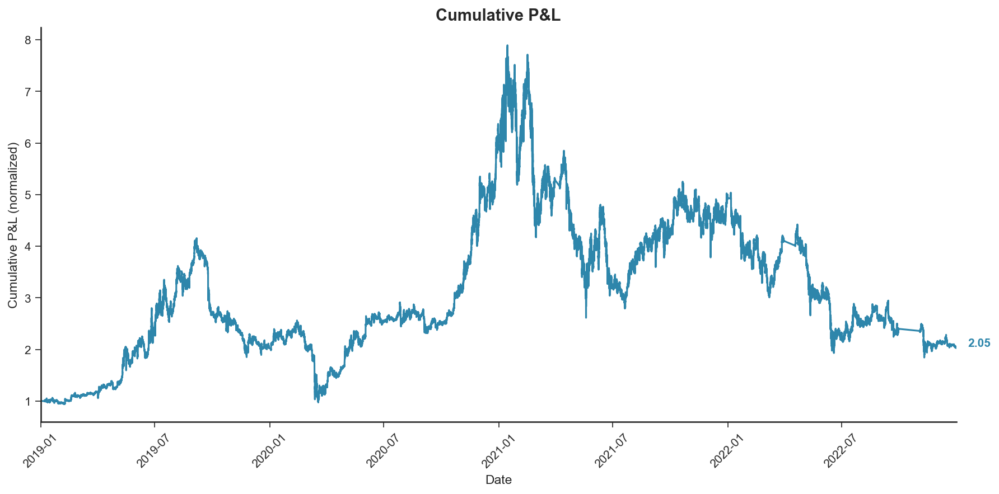

# Evaluating Technical Trading Rules on Bitcoin

Evaluation of 3,669 strategies based on technical trading rules applied to Bitcoin 5-minute data, with data snooping correction via White's Reality Check, walk-forward out-of-sample testing, and machine learning signal combination.

> This README is a concise overview. For extensive description and full visualizations, please see the **[Streamlit link]**.

## Data

BTC/USD 5-minute data from Bitstamp exchange, January 2017 to December 2022. Transaction cost: 10 bps per trade.

## Trading Universe

Seven classes of strategies based on technical trading rules, each tested across a parameter grid:

| Strategy Class | Parameters | Contrarian | Combinations |
|----------------|-----------|:----------:|-------------:|
| Filter | n, x, c, d | no | 144 |
| Moving Average | s, l, b, c, d | yes | 1,350 |
| Support & Resistance | n, b, c, d | yes | 540 |
| Channel Breakout | n, x, b, c | yes | 600 |
| RSI | n, v, c, d | no | 180 |
| Bollinger Bands | n, k, c, d | no | 180 |
| On-Balance Volume | s, l, b, c, d | no | 675 |
| | | **Total** | **3,669** |

Common parameters across strategies: c (holding period filter) ∈ {0, 1, 2} and d (signal confirmation delay) ∈ {0, 1, 2}.

Contrarian strategies reverse the trading signal: they sell when the original rule says buy, and buy when it says sell.

## How Strategies Trade

Each strategy generates a signal (+1 or -1) at every 5-minute interval based on its trading rule and parameters. After an initial warmup period, the strategy is always either long or short — fully invested with no leverage or partial allocation. Returns are computed as position (+1 or -1) multiplied by the asset's log return for that interval. A transaction cost of 10 bps is applied per side of each trade (20 bps per position change or a flip).

## Methodology

**Phase 1 — full-sample backtest + data snooping correction.** All 3,669 strategies are tested on the full sample. White's Reality Check (2000) with Politis-Romano stationary bootstrap (B=1,000, q=0.1) is applied to net returns to correct for multiple hypothesis testing — the risk that some strategies appear profitable purely by chance when testing thousands simultaneously.

**Phase 2 — walk-forward analysis.** Although Phase 1 shows no statistically significant alpha, we test the best-performing strategy out of sample to explore the gap between statistical significance and practical performance. MAc(7,10) is tested using expanding-window walk-forward tech: training begins with 2017-2018, and each subsequent period adds one year of training data, with annual out-of-sample periods from 2019 through 2022. Parameters are fixed, no re-optimization occurs.

**Phase 3 — signal combination.** Raw signals from all 3,669 strategies are used as input features for a LightGBM model, trained via expanding-window walk-forward with quarterly retraining to predict forward return direction. A 25 bps bandwidth filter classifies target returns (round-trip transaction cost of 20 bps plus a small margin to filter noise). When the model predicts no clear direction, the current position is maintained rather than exiting to cash, reducing turnover and transaction costs.

## Results

### Phase 1: Top Strategies by Sharpe Ratio

| Rank | Strategy | Sharpe | Trades | Return |
|-----:|----------|-------:|-------:|-------:|
| 1 | MAc(2,10) | 1.213 | 2,453 | +553% |
| 2 | MAc(3,15) | 0.956 | 2,550 | +415% |
| 3 | MAc(7,10) | 0.949 | 151 | +411% |
| 4 | MAc(3,10) | 0.757 | 1,623 | +308% |
| 5 | MAc(10,15) | 0.660 | 258 | +255% |
| 6 | MAc(2,7) | 0.655 | 1,621 | +253% |
| 7 | MAc(3,5) | 0.550 | 258 | +196% |
| 8 | MAc(7,15) | 0.525 | 882 | +183% |
| 9 | MAc(3,7) | 0.462 | 849 | +149% |
| 10 | MAc(2,5) | 0.382 | 871 | +106% |

Buy-and-hold BTC returned +184% over the same period. All top 10 strategies are contrarian moving average crossovers (MAc) with bandwidth b=0.01. MAc(7,10) is the best strategy by net returns after transaction costs (151 trades vs 2,453 for the highest-Sharpe MAc(2,10)), and is the strategy carried forward into Phase 2.

### White's Reality Check

| Metric | Value |
|--------|------:|
| Strategies tested | 3,669 |
| Best strategy (net returns) | MAc(7,10) |
| Best in-sample Sharpe | 0.949 |
| WRC p-value | 0.846 |

With p = 0.846, we cannot reject the null hypothesis that the best strategy's outperformance is due to chance. No technical trading rule shows statistically significant alpha after correcting for data snooping.

### Phase 2: Walk-Forward Analysis

MAc(7,10) with fixed parameters tested on 4 annual out-of-sample periods (expanding window):

| Period | Training | OOS Sharpe | Strategy Return | Buy & Hold |
|--------|----------|----------:|----------------:|-----------:|
| 2019 | 2017-2018 | 0.91 | +96% | +95% |
| 2020 | 2017-2019 | 2.12 | +414% | +306% |
| 2021 | 2017-2020 | 1.31 | +246% | +63% |
| 2022 | 2017-2021 | 1.74 | +187% | -64% |
| **Average** | | **1.52** | | |

Profitable in 4 out of 4 out-of-sample periods, outperforming buy-and-hold in 3 of 4. When parameters are instead optimized each period (WFO), profitability drops to 3/4 with Sharpe degradation of -10.4%, consistent with mild overfitting. This illustrates the gap between statistical significance (WRC p = 0.846) and practical out-of-sample performance.

### Phase 3: Signal Combination (LightGBM)

All 3,669 strategy signals are combined as features in a LightGBM model trained via expanding-window walk-forward with quarterly retraining. The model outputs long/short/flat positions based on predicted return direction.

| Metric | Value |
|--------|------:|
| Total Return | +105.3% |
| CAGR | 19.7% |
| Ann. Volatility | 65.6% |
| Sharpe Ratio | 0.191 |
| Sortino Ratio | 0.231 |
| Max Drawdown | -76.7% |
| Win Rate | 58.6% |
| Profit Factor | 1.05 |
| Total Trades | 1,015 |
| Bootstrap p-value | 0.328 |

The combined strategy produces positive out-of-sample returns, but the result is not statistically significant (p = 0.328). The observed alpha may not be reliably different from zero.

## Equity Curve

## Key Findings

After testing 3,669 technical trading rules on Bitcoin with proper statistical controls, no statistically significant alpha is found — neither from individual strategies (WRC p = 0.846) nor from machine learning signal combination (bootstrap p = 0.328). However, the best individual strategy (MAc(7,10)) shows consistent out-of-sample profitability in walk-forward testing (4/4 periods), highlighting the gap between formal statistical significance and practical trading performance.

## References

- White, H. (2000). A Reality Check for Data Snooping. *Econometrica*, 68(5), 1097-1126.
- Politis, D. N., & Romano, J. P. (1994). The Stationary Bootstrap. *JASA*, 89(428), 1303-1313.
- Schulmeister, S. (2009). Profitability of Technical Stock Trading: Has It Moved from Daily to Intraday Data? *Review of Financial Economics*, 18(4), 190-201.
